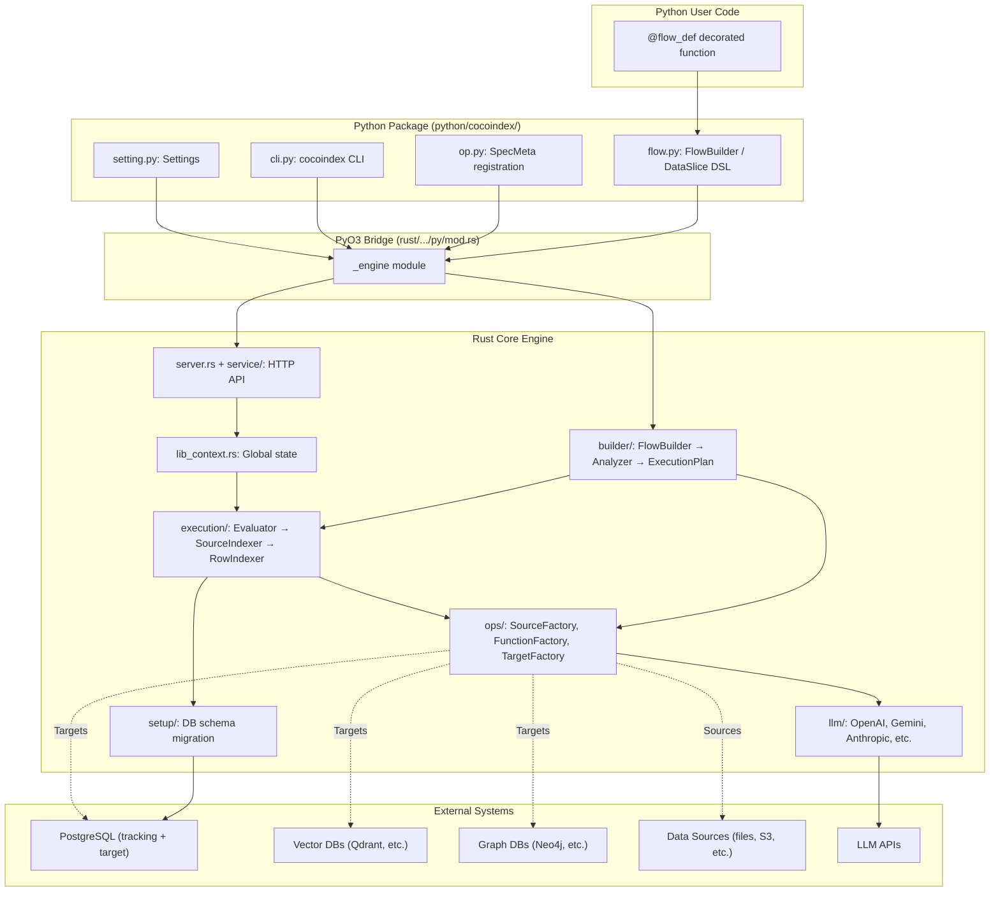

# CocoIndex — Comprehensive Architecture Analysis

CocoIndex is a **framework for building and maintaining indexing pipelines**. Users declaratively define data transformations, and CocoIndex builds and incrementally maintains the resulting index, keeping it in sync with source data using minimal computation.

The project is a **hybrid Rust/Python codebase**. Rust handles the performance-critical core engine (execution, storage, LLM calls). Python provides the user-facing API, CLI, and extensibility layer. The two are linked at build time via [PyO3](https://pyo3.rs/) and [Maturin](https://maturin.rs/) into a single native Python extension module called [\_engine](./rust/cocoindex/src/py/mod.rs#609-651).

---

## Table of Contents

- [Repository Structure at a Glance](#repository-structure-at-a-glance)
- [Rust Core Engine](#rust-core-engine)
  - [base/ — Foundational Types](#base--foundational-types)
  - [builder/ — Flow Construction & Analysis](#builder--flow-construction--analysis)
  - [execution/ — Runtime Evaluation & Indexing](#execution--runtime-evaluation--indexing)
  - [ops/ — Operations (Sources, Functions, Targets)](#ops--operations-sources-functions-targets)
  - [llm/ — LLM Provider Integrations](#llm--llm-provider-integrations)
  - [server.rs — HTTP API Server](#serverrs--http-api-server)
  - [service/ — API Route Handlers](#service--api-route-handlers)
  - [setup/ — Database Schema Management](#setup--database-schema-management)
  - [settings.rs — Configuration](#settingsrs--configuration)
  - [lib_context.rs — Global Runtime State](#lib_contextrs--global-runtime-state)
  - [py/ — PyO3 Bindings](#py--pyo3-bindings)
  - [prelude.rs — Common Imports](#preluders--common-imports)
- [Rust Utility Crates](#rust-utility-crates)
  - [utils/ — Shared Utilities](#utils--shared-utilities)
  - [ops_text/ — Text Processing](#ops_text--text-processing)
  - [py_utils/ — PyO3 Helpers](#py_utils--pyo3-helpers)
- [Python Package](#python-package)
  - [flow.py — Flow Definition DSL](#flowpy--flow-definition-dsl)
  - [op.py — Operator Registration](#oppy--operator-registration)
  - [cli.py — Command-Line Interface](#clipy--command-line-interface)
  - [functions/ — Python-Side Functions](#functions--python-side-functions)
  - [sources/ — Source Connector Specs](#sources--source-connector-specs)
  - [targets/ — Export Target Specs](#targets--export-target-specs)
  - [Other Python Modules](#other-python-modules)
  - [tests/ — Python Tests](#tests--python-tests)
- [Build System](#build-system)
- [CI/CD & Dev Tooling](#cicd--dev-tooling)
- [Docs & Examples](#docs--examples)
- [Data Flow Diagram](#data-flow-diagram)

---

## Repository Structure at a Glance

```
cocoindex/
├── rust/                        # Rust workspace
│   ├── cocoindex/src/           #   Main engine crate
│   │   ├── base/                #     Schema, spec, value types
│   │   ├── builder/             #     Flow construction & analysis
│   │   ├── execution/           #     Evaluator, indexers, live updater
│   │   ├── ops/                 #     Source, function, target impls
│   │   ├── llm/                 #     LLM provider adapters
│   │   ├── py/                  #     PyO3 bindings → _engine module
│   │   ├── service/             #     API route handlers
│   │   ├── setup/               #     DB schema management
│   │   ├── server.rs            #     Axum HTTP server
│   │   ├── settings.rs          #     Configuration structs
│   │   ├── lib_context.rs       #     Global runtime context
│   │   └── prelude.rs           #     Common re-exports
│   ├── utils/                   #   Shared utility crate
│   ├── ops_text/                #   Text splitting/language detection
│   └── py_utils/                #   PyO3 error/future helpers
├── python/cocoindex/            # Python package
│   ├── __init__.py              #   Public API surface
│   ├── flow.py                  #   Flow builder DSL
│   ├── op.py                    #   Operator registration
│   ├── cli.py                   #   Click CLI (cocoindex command)
│   ├── functions/               #   Python-side functions (sbert, colpali)
│   ├── sources/                 #   Source connector spec wrappers
│   ├── targets/                 #   Target connector spec wrappers + Python impls
│   ├── tests/                   #   Unit/integration tests
│   └── ...                      #   engine_type, engine_value, setting, etc.
├── examples/                    # 32+ example projects
├── docs/                        # Docusaurus documentation site
├── dev/                         # Dev scripts & compose files
├── .github/workflows/           # CI/CD pipelines
├── pyproject.toml               # Python/Maturin build config
└── Cargo.toml                   # Rust workspace config
```

---

## Rust Core Engine

All core engine code lives under [rust/cocoindex/src/](./rust/cocoindex/src). The entry point is [lib.rs](./rust/cocoindex/src/lib.rs), which declares all modules:

```rust
mod base;
mod builder;
mod execution;
mod lib_context;
mod llm;
mod ops;
mod prelude;
mod py;
mod server;
mod service;
mod settings;
mod setup;
```

---

### base/ — Foundational Types

**Path**: [rust/cocoindex/src/base/](./rust/cocoindex/src/base)

The type system underpinning the entire engine. Everything else depends on these types.

| File                                                              | Purpose                                                                                                                                                                                                                                                                                                                                                                                |
| ----------------------------------------------------------------- | -------------------------------------------------------------------------------------------------------------------------------------------------------------------------------------------------------------------------------------------------------------------------------------------------------------------------------------------------------------------------------------- |
| [schema.rs](./rust/cocoindex/src/base/schema.rs) (13KB)           | Defines `ValueType` (Basic, Table, Struct), `FieldSchema`, `TableSchema`, `FlowSchema`. These describe the shape of data flowing through pipelines.                                                                                                                                                                                                                                    |
| [spec.rs](./rust/cocoindex/src/base/spec.rs) (20KB)               | Defines the declarative specification for flows: `ImportOpSpec`, `ReactiveOpSpec`, `ExportOpSpec`, `FlowInstanceSpec`. This is the "blueprint" of a pipeline.                                                                                                                                                                                                                          |
| [value.rs](./rust/cocoindex/src/base/value.rs) (59KB)             | The runtime value types: [Value](./rust/cocoindex/src/execution/evaluator.rs#18-22), `BasicValue`, `KeyValue`, [ScopeValue](./rust/cocoindex/src/execution/evaluator.rs#18-22), `FieldValues`. Includes serialization, comparison, and memory estimation. The largest file in [base/](./rust/cocoindex/src/execution/evaluator.rs#140-147) because it handles all data representation. |
| [json_schema.rs](./rust/cocoindex/src/base/json_schema.rs) (51KB) | Converts between CocoIndex schemas and JSON Schema. Used for LLM structured output and API documentation.                                                                                                                                                                                                                                                                              |
| [field_attrs.rs](./rust/cocoindex/src/base/field_attrs.rs)        | Field-level attribute storage (e.g., marking a field as an embedding origin).                                                                                                                                                                                                                                                                                                          |
| [duration.rs](./rust/cocoindex/src/base/duration.rs) (22KB)       | Human-readable duration parsing and formatting.                                                                                                                                                                                                                                                                                                                                        |

**Links to other modules**: Used by every other module. [builder/](./rust/cocoindex/src/execution/evaluator.rs#275-287) reads specs. [execution/](./rust/cocoindex/src/lib_context.rs#135-147) operates on values. `ops/` produces and consumes values.

---

### builder/ — Flow Construction & Analysis

**Path**: [rust/cocoindex/src/builder/](./rust/cocoindex/src/builder)

Takes the declarative spec from `base/spec` and produces an analyzed, executable representation.

| File                                                                    | Purpose                                                                                                                                                                                                                                                                                                                                                   |
| ----------------------------------------------------------------------- | --------------------------------------------------------------------------------------------------------------------------------------------------------------------------------------------------------------------------------------------------------------------------------------------------------------------------------------------------------- |
| [flow_builder.rs](./rust/cocoindex/src/builder/flow_builder.rs) (31KB)  | The `FlowBuilder` pyclass — the main entry point from Python. Exposes [DataSlice](./rust/cocoindex/src/builder/flow_builder.rs#101-105), [DataCollector](./rust/cocoindex/src/builder/flow_builder.rs#199-204), [OpScopeRef](./rust/cocoindex/src/builder/flow_builder.rs#30-31) as PyO3 classes. Tracks the specification as the user chains operations. |
| [analyzer.rs](./rust/cocoindex/src/builder/analyzer.rs) (57KB)          | The heaviest file. Validates the spec, resolves field references, builds the `ExecutionPlan`, instantiates operator factories, and produces `AnalyzedFlow`.                                                                                                                                                                                               |
| [plan.rs](./rust/cocoindex/src/builder/plan.rs) (5KB)                   | Defines the `ExecutionPlan` data structures: `AnalyzedOpScope`, `AnalyzedReactiveOp`, `AnalyzedImportOp`, `AnalyzedValueMapping`.                                                                                                                                                                                                                         |
| [analyzed_flow.rs](./rust/cocoindex/src/builder/analyzed_flow.rs) (2KB) | The `AnalyzedFlow` and `AnalyzedTransientFlow` structs that bundle the spec, schema, and execution plan together.                                                                                                                                                                                                                                         |
| [exec_ctx.rs](./rust/cocoindex/src/builder/exec_ctx.rs) (13KB)          | `FlowSetupExecutionContext` — bridges the analyzed flow to the setup/migration layer.                                                                                                                                                                                                                                                                     |

**Links**: `FlowBuilder` is exposed to Python via [py/mod.rs](./rust/cocoindex/src/py/mod.rs). [analyzer.rs](./rust/cocoindex/src/builder/analyzer.rs) calls into `ops/` to build operator executors. The output `ExecutionPlan` feeds into [execution/](./rust/cocoindex/src/lib_context.rs#135-147).

---

### execution/ — Runtime Evaluation & Indexing

**Path**: [rust/cocoindex/src/execution/](./rust/cocoindex/src/execution)

The runtime that actually processes data. This is where source data is read, transformations are applied, and results are written to targets.

| File                                                                               | Purpose                                                                                                                                                                                                                                                                                                          |
| ---------------------------------------------------------------------------------- | ---------------------------------------------------------------------------------------------------------------------------------------------------------------------------------------------------------------------------------------------------------------------------------------------------------------- |
| [evaluator.rs](./rust/cocoindex/src/execution/evaluator.rs) (28KB)                 | Core evaluation loop. [evaluate_op_scope()](./rust/cocoindex/src/execution/evaluator.rs#401-633) iterates through `AnalyzedReactiveOp`s (Transform, ForEach, Collect) and populates [ScopeValueBuilder](./rust/cocoindex/src/execution/evaluator.rs#18-22)s. Includes timeout/warning logic for slow operations. |
| [source_indexer.rs](./rust/cocoindex/src/execution/source_indexer.rs) (29KB)       | Reads from source connectors, tracks change ordinals, and feeds rows into the evaluator. Handles incremental updates by comparing ordinals.                                                                                                                                                                      |
| [row_indexer.rs](./rust/cocoindex/src/execution/row_indexer.rs) (42KB)             | Manages per-row indexing state. Compares current vs. previous row data, upserts/deletes into export targets, and updates tracking tables. The largest execution file.                                                                                                                                            |
| [live_updater.rs](./rust/cocoindex/src/execution/live_updater.rs) (24KB)           | [FlowLiveUpdater](./rust/cocoindex/src/py/mod.rs#155-156) — watches for source changes and re-indexes affected rows. Supports both polling and streaming change detection.                                                                                                                                       |
| [db_tracking.rs](./rust/cocoindex/src/execution/db_tracking.rs) (19KB)             | Persisted tracking state in Postgres: which rows have been indexed, their fingerprints, ordinals.                                                                                                                                                                                                                |
| [db_tracking_setup.rs](./rust/cocoindex/src/execution/db_tracking_setup.rs) (23KB) | Creates/migrates the tracking tables in Postgres.                                                                                                                                                                                                                                                                |
| [stats.rs](./rust/cocoindex/src/execution/stats.rs) (22KB)                         | Collects metrics: rows processed, bytes transferred, operation durations, displayed via `indicatif` progress bars.                                                                                                                                                                                               |
| [memoization.rs](./rust/cocoindex/src/execution/memoization.rs) (8KB)              | In-memory evaluation cache. Caches function results keyed by input fingerprint for expensive operations (e.g., LLM calls, embeddings).                                                                                                                                                                           |
| [dumper.rs](./rust/cocoindex/src/execution/dumper.rs) (10KB)                       | [evaluate_and_dump()](./rust/cocoindex/src/py/mod.rs#219-243) — runs the flow and writes outputs to files instead of targets. Used for offline evaluation/debugging.                                                                                                                                             |
| [indexing_status.rs](./rust/cocoindex/src/execution/indexing_status.rs) (4KB)      | Logic fingerprinting for change detection — determines if source logic has changed and a re-index is needed.                                                                                                                                                                                                     |

**Links**: Driven by [py/mod.rs](./rust/cocoindex/src/py/mod.rs) (which exposes [Flow](./rust/cocoindex/src/py/mod.rs#118-119), [FlowLiveUpdater](./rust/cocoindex/src/py/mod.rs#155-156)). Uses `builder/plan` for the execution plan. Calls `ops/interface` executor traits. Writes to [setup/](./python/cocoindex/cli.py#320-351) tracking tables via `db_tracking`.

---

### ops/ — Operations (Sources, Functions, Targets)

**Path**: [rust/cocoindex/src/ops/](./rust/cocoindex/src/ops)

Defines the pluggable operator system and all built-in implementations.

#### Core Infrastructure

| File                                                                 | Purpose                                                                                                                                                                                                                                                                                                                                                                                           |
| -------------------------------------------------------------------- | ------------------------------------------------------------------------------------------------------------------------------------------------------------------------------------------------------------------------------------------------------------------------------------------------------------------------------------------------------------------------------------------------- |
| [interface.rs](./rust/cocoindex/src/ops/interface.rs) (12KB)         | **The trait definitions**: [SourceExecutor](./rust/cocoindex/src/ops/interface.rs#138-161), [SourceFactory](./rust/cocoindex/src/ops/interface.rs#163-174), [SimpleFunctionExecutor](./rust/cocoindex/src/ops/interface.rs#176-189), [SimpleFunctionFactory](./rust/cocoindex/src/ops/interface.rs#201-209), `ExportTargetExecutor`, `ExportTargetFactory`. All operators implement these traits. |
| [registry.rs](./rust/cocoindex/src/ops/registry.rs) (4KB)            | Global operator registry. Stores factories by name.                                                                                                                                                                                                                                                                                                                                               |
| [registration.rs](./rust/cocoindex/src/ops/registration.rs) (4KB)    | `register_factory()` function and auto-registration of all built-in ops at startup.                                                                                                                                                                                                                                                                                                               |
| [factory_bases.rs](./rust/cocoindex/src/ops/factory_bases.rs) (28KB) | Common factory logic shared across op types (spec deserialization, schema building).                                                                                                                                                                                                                                                                                                              |
| [py_factory.rs](./rust/cocoindex/src/ops/py_factory.rs) (41KB)       | `PyFunctionFactory`, `PySourceConnectorFactory`, `PyExportTargetFactory` — wraps Python callables as Rust operator executors. This is how user-defined Python functions/connectors integrate into the Rust execution engine.                                                                                                                                                                      |
| [sdk.rs](./rust/cocoindex/src/ops/sdk.rs) (4KB)                      | Helper macros and utilities for implementing operators.                                                                                                                                                                                                                                                                                                                                           |

#### Built-in Sources ([ops/sources/](./rust/cocoindex/src/ops/sources))

| File                                                                       | Data Source                          |
| -------------------------------------------------------------------------- | ------------------------------------ |
| [local_file.rs](./rust/cocoindex/src/ops/sources/local_file.rs) (11KB)     | Local filesystem files               |
| [amazon_s3.rs](./rust/cocoindex/src/ops/sources/amazon_s3.rs) (17KB)       | AWS S3 buckets                       |
| [azure_blob.rs](./rust/cocoindex/src/ops/sources/azure_blob.rs) (9KB)      | Azure Blob Storage                   |
| [google_drive.rs](./rust/cocoindex/src/ops/sources/google_drive.rs) (18KB) | Google Drive                         |
| [postgres.rs](./rust/cocoindex/src/ops/sources/postgres.rs) (34KB)         | PostgreSQL tables (with CDC support) |

#### Built-in Functions ([ops/functions/](./rust/cocoindex/src/ops/functions))

| File                                                                                      | Function                              |
| ----------------------------------------------------------------------------------------- | ------------------------------------- |
| [embed_text.rs](./rust/cocoindex/src/ops/functions/embed_text.rs) (8KB)                   | Text embedding via LLM providers      |
| [split_recursively.rs](./rust/cocoindex/src/ops/functions/split_recursively.rs) (16KB)    | Recursive text chunking               |
| [split_by_separators.rs](./rust/cocoindex/src/ops/functions/split_by_separators.rs) (6KB) | Split text by configurable separators |
| [extract_by_llm.rs](./rust/cocoindex/src/ops/functions/extract_by_llm.rs) (11KB)          | Structured extraction via LLM         |
| [parse_json.rs](./rust/cocoindex/src/ops/functions/parse_json.rs) (5KB)                   | JSON parsing into typed values        |
| [detect_program_lang.rs](./rust/cocoindex/src/ops/functions/detect_program_lang.rs) (4KB) | Programming language detection        |

#### Built-in Export Targets ([ops/targets/](./rust/cocoindex/src/ops/targets))

| File                                                               | Target                             |
| ------------------------------------------------------------------ | ---------------------------------- |
| [postgres.rs](./rust/cocoindex/src/ops/targets/postgres.rs) (38KB) | PostgreSQL (with pgvector support) |
| [qdrant.rs](./rust/cocoindex/src/ops/targets/qdrant.rs) (24KB)     | Qdrant vector database             |
| [neo4j.rs](./rust/cocoindex/src/ops/targets/neo4j.rs) (41KB)       | Neo4j graph database               |
| [falkordb.rs](./rust/cocoindex/src/ops/targets/falkordb.rs) (49KB) | FalkorDB graph database            |
| [ladybug.rs](./rust/cocoindex/src/ops/targets/ladybug.rs) (38KB)   | Ladybug (internal?) target         |

#### Shared Utilities ([ops/shared/](./rust/cocoindex/src/ops/shared))

| File                                                       | Purpose                                                           |
| ---------------------------------------------------------- | ----------------------------------------------------------------- |
| [postgres.rs](./rust/cocoindex/src/ops/shared/postgres.rs) | Shared Postgres connection helpers used by both source and target |
| [split.rs](./rust/cocoindex/src/ops/shared/split.rs)       | Common splitting logic shared between splitter functions          |

**Links**: [interface.rs](./rust/cocoindex/src/ops/interface.rs) traits are used by [execution/evaluator.rs](./rust/cocoindex/src/execution/evaluator.rs) and [builder/analyzer.rs](./rust/cocoindex/src/builder/analyzer.rs). [py_factory.rs](./rust/cocoindex/src/ops/py_factory.rs) bridges Python operators registered via [py/mod.rs](./rust/cocoindex/src/py/mod.rs). [registration.rs](./rust/cocoindex/src/ops/registration.rs) is called at startup.

---

### llm/ — LLM Provider Integrations

**Path**: [rust/cocoindex/src/llm/](./rust/cocoindex/src/llm)

Abstracts over multiple LLM APIs with a common interface.

| File                                                                                                                                                    | Provider                                                       |
| ------------------------------------------------------------------------------------------------------------------------------------------------------- | -------------------------------------------------------------- |
| [mod.rs](./rust/cocoindex/src/llm/mod.rs) (7KB)                                                                                                         | Common `LlmApi` trait, `LlmSpec` config, and provider dispatch |
| [openai.rs](./rust/cocoindex/src/llm/openai.rs) (9KB)                                                                                                   | OpenAI API                                                     |
| [gemini.rs](./rust/cocoindex/src/llm/gemini.rs) (16KB)                                                                                                  | Google Gemini (largest — likely supports multimodal)           |
| [anthropic.rs](./rust/cocoindex/src/llm/anthropic.rs) (6KB)                                                                                             | Anthropic Claude                                               |
| [bedrock.rs](./rust/cocoindex/src/llm/bedrock.rs) (7KB)                                                                                                 | AWS Bedrock                                                    |
| [ollama.rs](./rust/cocoindex/src/llm/ollama.rs) (5KB)                                                                                                   | Ollama (local models)                                          |
| [voyage.rs](./rust/cocoindex/src/llm/voyage.rs) (3KB)                                                                                                   | Voyage AI (embeddings)                                         |
| [litellm.rs](./rust/cocoindex/src/llm/litellm.rs), [openrouter.rs](./rust/cocoindex/src/llm/openrouter.rs), [vllm.rs](./rust/cocoindex/src/llm/vllm.rs) | Thin wrappers (OpenAI-compatible)                              |

**Links**: Called by [ops/functions/embed_text.rs](./rust/cocoindex/src/ops/functions/embed_text.rs) and [ops/functions/extract_by_llm.rs](./rust/cocoindex/src/ops/functions/extract_by_llm.rs). Configuration comes from the Python-side `LlmSpec`.

---

### server.rs — HTTP API Server

**Path**: [server.rs](./rust/cocoindex/src/server.rs) (3KB)

A lightweight [Axum](https://github.com/tokio-rs/axum) HTTP server. Routes:

| Endpoint                                                  | Handler               |
| --------------------------------------------------------- | --------------------- |
| `GET /healthz`                                            | Health check          |
| `GET /cocoindex`                                          | Running status        |
| `GET /cocoindex/api/flows`                                | List all flows        |
| `GET /cocoindex/api/flows/{name}`                         | Get flow details      |
| `GET /cocoindex/api/flows/{name}/schema`                  | Get flow schema       |
| `GET /cocoindex/api/flows/{name}/keys`                    | Get indexed keys      |
| `GET /cocoindex/api/flows/{name}/data`                    | Evaluate/fetch data   |
| `GET /cocoindex/api/flows/{name}/queryHandlers/{handler}` | Execute query handler |
| `GET /cocoindex/api/flows/{name}/rowStatus`               | Row indexing status   |
| `POST /cocoindex/api/flows/{name}/update`                 | Trigger flow update   |

**Links**: Route handlers are in [service/flows.rs](./rust/cocoindex/src/service/flows.rs). Started from Python via `py/mod.rs::start_server()`.

---

### service/ — API Route Handlers

**Path**: [rust/cocoindex/src/service/](./rust/cocoindex/src/service)

| File                                                                    | Purpose                                                                                                                                              |
| ----------------------------------------------------------------------- | ---------------------------------------------------------------------------------------------------------------------------------------------------- |
| [flows.rs](./rust/cocoindex/src/service/flows.rs) (11KB)                | Implements all the `/cocoindex/api/flows/...` handlers. Reads from `LibContext` to serve flow data.                                                  |
| [query_handler.rs](./rust/cocoindex/src/service/query_handler.rs) (1KB) | [QueryHandler](./rust/cocoindex/src/py/mod.rs#387-390) trait and `QueryHandlerSpec` — allows Python-defined query handlers to be called via the API. |

**Links**: Used by [server.rs](./rust/cocoindex/src/server.rs). Reads from [lib_context.rs](./rust/cocoindex/src/lib_context.rs). Query handlers are registered from Python via `py/mod.rs::Flow.add_query_handler()`.

---

### setup/ — Database Schema Management

**Path**: [rust/cocoindex/src/setup/](./rust/cocoindex/src/setup)

Manages the lifecycle of database schemas, tables, and target setups.

| File                                                                  | Purpose                                                                                                                                                          |
| --------------------------------------------------------------------- | ---------------------------------------------------------------------------------------------------------------------------------------------------------------- |
| [driver.rs](./rust/cocoindex/src/setup/driver.rs) (37KB)              | [SetupChangeBundle](./rust/cocoindex/src/py/mod.rs#479-480) — orchestrates setup/drop operations. Compares desired vs. current state, generates migration steps. |
| [states.rs](./rust/cocoindex/src/setup/states.rs) (18KB)              | `FlowSetupState`, `AllSetupStates` — tracks what's currently set up in the database vs. what's needed.                                                           |
| [db_metadata.rs](./rust/cocoindex/src/setup/db_metadata.rs) (13KB)    | Reads/writes setup metadata to Postgres (what flows exist, their schemas, versions).                                                                             |
| [components.rs](./rust/cocoindex/src/setup/components.rs) (6KB)       | Defines `ObjectSetupChange` — the atomic unit of a setup change (create table, add column, etc.).                                                                |
| [auth_registry.rs](./rust/cocoindex/src/setup/auth_registry.rs) (2KB) | `AuthRegistry` — stores authentication credentials (API keys, tokens) by name.                                                                                   |
| [flow_features.rs](./rust/cocoindex/src/setup/flow_features.rs)       | Feature flags per-flow.                                                                                                                                          |

**Links**: Called by [py/mod.rs](./rust/cocoindex/src/py/mod.rs) (via [SetupChangeBundle](./rust/cocoindex/src/py/mod.rs#479-480)). Uses [lib_context.rs](./rust/cocoindex/src/lib_context.rs) for DB connections. Read by [execution/](./rust/cocoindex/src/lib_context.rs#135-147) to understand current schema state.

---

### settings.rs — Configuration

**Path**: [settings.rs](./rust/cocoindex/src/settings.rs) (4KB)

Simple configuration structs deserialized from the Python-provided settings:

- [DatabaseConnectionSpec](./rust/cocoindex/src/settings.rs#4-11) — Postgres URL, credentials, pool sizes
- [GlobalExecutionOptions](./rust/cocoindex/src/settings.rs#13-17) — concurrency limits
- [Settings](./rust/cocoindex/src/settings.rs#19-32) — top-level config (database, schema name, app namespace)

**Links**: Consumed by [lib_context.rs](./rust/cocoindex/src/lib_context.rs) when initializing. Set from Python via `py/mod.rs::set_settings_fn()`.

---

### lib_context.rs — Global Runtime State

**Path**: [lib_context.rs](./rust/cocoindex/src/lib_context.rs) (15KB)

The singleton runtime context. Key types:

- `LibContext` — holds DB pools, setup context, persistence context, progress bars
- [FlowContext](./rust/cocoindex/src/lib_context.rs#110-115) — per-flow state (analyzed flow + execution context)
- [FlowExecutionContext](./rust/cocoindex/src/lib_context.rs#18-23) — per-flow execution state with source indexing contexts
- [DbPools](./rust/cocoindex/src/lib_context.rs#180-183) — connection pool manager
- `TOKIO_RUNTIME` — the single Tokio runtime instance (like a global thread pool)
- `AUTH_REGISTRY` — global auth credential store

**Links**: Initialized by `py/mod.rs::init()`. Used by virtually every other module. Passed as `Arc<LibContext>` to server routes, setup operations, and execution.

---

### py/ — PyO3 Bindings

**Path**: [rust/cocoindex/src/py/](./rust/cocoindex/src/py)

| File                                             | Purpose                                                                                                                                                     |
| ------------------------------------------------ | ----------------------------------------------------------------------------------------------------------------------------------------------------------- |
| [mod.rs](./rust/cocoindex/src/py/mod.rs) (22KB)  | The `#[pymodule] fn cocoindex_engine` that defines the [\_engine](./rust/cocoindex/src/py/mod.rs#609-651) Python module. Exports all functions and classes. |
| [convert.rs](./rust/cocoindex/src/py/convert.rs) | `Pythonized<T>` wrapper and value conversion between Python objects and Rust [Value](./rust/cocoindex/src/execution/evaluator.rs#18-22) types.              |

**Exported to Python**:

- **Functions**: [init](./rust/cocoindex/src/py/mod.rs#44-51), [stop](./rust/cocoindex/src/py/mod.rs#64-69), [start_server](./rust/cocoindex/src/py/mod.rs#52-63), [register_source_connector](./rust/cocoindex/src/py/mod.rs#70-77), [register_function_factory](./rust/cocoindex/src/py/mod.rs#78-85), [register_target_connector](./rust/cocoindex/src/py/mod.rs#86-93), [flow_names_with_setup_async](./rust/cocoindex/src/py/mod.rs#517-531), [make_setup_bundle](./rust/cocoindex/src/py/mod.rs#532-540), [make_drop_bundle](./rust/cocoindex/src/py/mod.rs#541-549), etc.
- **Classes**: `FlowBuilder`, [DataSlice](./rust/cocoindex/src/builder/flow_builder.rs#101-105), [DataCollector](./rust/cocoindex/src/builder/flow_builder.rs#199-204), [OpScopeRef](./rust/cocoindex/src/builder/flow_builder.rs#30-31), [Flow](./rust/cocoindex/src/py/mod.rs#118-119), [FlowLiveUpdater](./rust/cocoindex/src/py/mod.rs#155-156), [TransientFlow](./rust/cocoindex/src/py/mod.rs#444-445), [IndexUpdateInfo](./rust/cocoindex/src/py/mod.rs#95-96), [SetupChangeBundle](./rust/cocoindex/src/py/mod.rs#479-480), [RenderedSpec](./rust/cocoindex/src/py/mod.rs#133-137)

**Links**: This is the **central bridge** between Python and Rust. Every Python interaction with the engine goes through here.

---

### prelude.rs — Common Imports

**Path**: [prelude.rs](./rust/cocoindex/src/prelude.rs) (2KB)

Re-exports commonly used types from [base/](./rust/cocoindex/src/execution/evaluator.rs#140-147), `std`, `anyhow`, [serde](./rust/cocoindex/src/py/mod.rs#597-608), `indexmap`, `tracing`, and utility crates. Nearly every [.rs](./rust/utils/src/db.rs) file starts with `use crate::prelude::*`.

---

## Rust Utility Crates

### utils/ — Shared Utilities

**Path**: [rust/utils/src/](./rust/utils/src)

| File                                                          | Purpose                                                                        |
| ------------------------------------------------------------- | ------------------------------------------------------------------------------ |
| [fingerprint.rs](./rust/utils/src/fingerprint.rs) (14KB)      | `Fingerprinter` — BLAKE2 hashing for change detection and cache keys           |
| [batching.rs](./rust/utils/src/batching.rs) (20KB)            | Generic batching infrastructure for amortizing function calls                  |
| [error.rs](./rust/utils/src/error.rs) (18KB)                  | Error types: `InternalError`, `ClientError`, `ApiError` with HTTP status codes |
| [str_sanitize.rs](./rust/utils/src/str_sanitize.rs) (17KB)    | String sanitization for SQL identifiers, column names, etc.                    |
| [yaml_ser.rs](./rust/utils/src/yaml_ser.rs) (21KB)            | Custom YAML serialization for human-readable spec output                       |
| [concur_control.rs](./rust/utils/src/concur_control.rs) (6KB) | `ConcurrencyController` — semaphore-based concurrency and memory limiting      |
| [retryable.rs](./rust/utils/src/retryable.rs) (5KB)           | Exponential backoff retry logic                                                |
| [immutable.rs](./rust/utils/src/immutable.rs) (2KB)           | `RefList` — an immutable cons-list used for scope stacks in the evaluator      |
| [db.rs](./rust/utils/src/db.rs) (3KB)                         | SQL query helpers                                                              |
| [http.rs](./rust/utils/src/http.rs)                           | HTTP client helpers                                                            |
| [slow_warn.rs](./rust/utils/src/slow_warn.rs)                 | Logging warnings for slow operations                                           |

### ops_text/ — Text Processing

**Path**: [rust/ops_text/src/](./rust/ops_text/src)

| File                                                               | Purpose                                                                 |
| ------------------------------------------------------------------ | ----------------------------------------------------------------------- |
| [prog_langs.rs](./rust/ops_text/src/prog_langs.rs) (16KB)          | Programming language definitions (keywords, comment syntax, separators) |
| [pattern_matcher.rs](./rust/ops_text/src/pattern_matcher.rs) (3KB) | Glob/regex pattern matching                                             |
| [split/](./rust/ops_text/src/split)                                | Text splitting algorithms (recursive, by separators)                    |

### py_utils/ — PyO3 Helpers

**Path**: [rust/py_utils/src/](./rust/py_utils/src)

| File                                             | Purpose                                                                                       |
| ------------------------------------------------ | --------------------------------------------------------------------------------------------- |
| [error.rs](./rust/py_utils/src/error.rs) (3KB)   | `IntoPyResult` trait — converts Rust `Result` to `PyResult` with proper traceback propagation |
| [future.rs](./rust/py_utils/src/future.rs) (5KB) | `from_py_future()` — converts Python coroutines to Rust futures for async interop             |
| [convert.rs](./rust/py_utils/src/convert.rs)     | Python-to-Rust type conversion utilities                                                      |

---

## Python Package

**Path**: [python/cocoindex/](./python/cocoindex)

The Python package provides the user-facing API. It re-exports everything through [**init**.py](./python/cocoindex/__init__.py).

---

### flow.py — Flow Definition DSL

**Path**: [flow.py](./python/cocoindex/flow.py) (41KB, 1316 lines)

The heart of the Python API. Key types:

- **`FlowBuilder`** — Context manager for building flows. Wraps `_engine.FlowBuilder`.
- **[DataSlice](./rust/cocoindex/src/builder/flow_builder.rs#101-105)** — A lazy reference to data in a flow. Supports chaining `.transform()`, `.for_each()`, `.row()`, `[field_name]` access.
- **`DataScope`** — A scope within a [for_each()](./python/cocoindex/flow.py#253-269) loop, providing access to the current row.
- **[Flow](./rust/cocoindex/src/py/mod.rs#118-119)** — A compiled flow ready for execution, setup, and querying.
- **`@flow_def`** — Decorator to define flows declaratively.
- **[FlowLiveUpdater](./rust/cocoindex/src/py/mod.rs#155-156)** — Manages live/streaming index updates.
- **`transform_flow`** — Defines transient (non-persisted) flows for on-the-fly computation.

**Links**: Calls into `_engine.FlowBuilder`, `_engine.Flow`, `_engine.FlowLiveUpdater`. Uses [op.py](./python/cocoindex/op.py) for spec resolution.

---

### op.py — Operator Registration

**Path**: [op.py](./python/cocoindex/op.py) (40KB, 1102 lines)

The extensibility system. Key types:

- **[SpecMeta](./python/cocoindex/op.py#50-69)** — Metaclass that auto-registers Python classes as operator specs with the Rust engine.
- **[SourceSpec](./python/cocoindex/op.py#71-73)**, **[FunctionSpec](./python/cocoindex/op.py#75-77)**, **[TargetSpec](./python/cocoindex/op.py#79-81)**, **[DeclarationSpec](./python/cocoindex/op.py#87-89)** — Base classes for defining custom operators.
- **[\_register_op_factory()](./python/cocoindex/op.py#176-446)** — Registers a Python operator with the Rust engine, wrapping it with input/output encoding, batching, caching, and timeout support.
- **[OpArgs](./python/cocoindex/op.py#134-156)** — Configuration for operator behavior: GPU, caching, batching, timeouts.

**Links**: Calls `_engine.register_function_factory()`, `_engine.register_source_connector()`, `_engine.register_target_connector()`. Used by all operator definitions in `functions/`, [sources/](./rust/cocoindex/src/py/mod.rs#143-147), `targets/`.

---

### cli.py — Command-Line Interface

**Path**: [cli.py](./python/cocoindex/cli.py) (25KB, 861 lines)

Built with [Click](https://click.palletsprojects.com/). The [cocoindex](./rust/cocoindex/src/py/mod.rs#609-651) command entry point.

| Command                         | Purpose                                          |
| ------------------------------- | ------------------------------------------------ |
| `cocoindex ls [APP]`            | List flows and their setup status                |
| `cocoindex show APP[:FLOW]`     | Show flow spec and schema                        |
| `cocoindex setup APP`           | Create/migrate backend schemas                   |
| `cocoindex drop APP [FLOWS...]` | Drop flow backend setups                         |
| `cocoindex update APP[:FLOW]`   | Run index update (one-shot or `--live`)          |
| `cocoindex evaluate APP[:FLOW]` | Evaluate flow and dump to files                  |
| `cocoindex server APP`          | Start HTTP API server (with optional `--reload`) |

**Links**: Imports [flow.py](./python/cocoindex/flow.py), [setup.py](./python/cocoindex/setup.py), [lib.py](./python/cocoindex/lib.py). Calls `_engine.init()`, `setup_all_flows()`, `update_all_flows_async()`.

---

### functions/ — Python-Side Functions

**Path**: [python/cocoindex/functions/](./python/cocoindex/functions)

| File                                                                               | Purpose                                                                                    |
| ---------------------------------------------------------------------------------- | ------------------------------------------------------------------------------------------ |
| [\_engine_builtin_specs.py](./python/cocoindex/functions/_engine_builtin_specs.py) | Python spec wrappers for Rust-implemented functions (SplitRecursively, ExtractByLlm, etc.) |
| [sbert.py](./python/cocoindex/functions/sbert.py) (3KB)                            | Sentence-BERT embedding via `sentence-transformers`                                        |
| [colpali.py](./python/cocoindex/functions/colpali.py) (9KB)                        | ColPali multi-vector embedding for document images                                         |

### sources/ — Source Connector Specs

**Path**: [python/cocoindex/sources/](./python/cocoindex/sources)

| File                                                                                   | Purpose                                                                                       |
| -------------------------------------------------------------------------------------- | --------------------------------------------------------------------------------------------- |
| [\_engine_builtin_specs.py](./python/cocoindex/sources/_engine_builtin_specs.py) (4KB) | Python spec wrappers for Rust sources (LocalFile, AmazonS3, GoogleDrive, AzureBlob, Postgres) |

### targets/ — Export Target Specs

**Path**: [python/cocoindex/targets/](./python/cocoindex/targets)

| File                                                                                   | Purpose                                                                        |
| -------------------------------------------------------------------------------------- | ------------------------------------------------------------------------------ |
| [\_engine_builtin_specs.py](./python/cocoindex/targets/_engine_builtin_specs.py) (5KB) | Python spec wrappers for Rust targets (Postgres, Qdrant, Neo4j, FalkorDB)      |
| [lancedb.py](./python/cocoindex/targets/lancedb.py) (21KB)                             | LanceDB target — **implemented entirely in Python**                            |
| [chromadb.py](./python/cocoindex/targets/chromadb.py) (12KB)                           | ChromaDB target — **implemented entirely in Python**                           |
| [doris.py](./python/cocoindex/targets/doris.py) (78KB)                                 | Apache Doris target — **implemented entirely in Python** (largest Python file) |
| [pinecone.py](./python/cocoindex/targets/pinecone.py) (14KB)                           | Pinecone target — **implemented entirely in Python**                           |

> [!NOTE]
> Some targets are Rust-native (Postgres, Qdrant, Neo4j) while others are Python-native (LanceDB, ChromaDB, Doris, Pinecone). Python targets are registered with the Rust engine via [op.py](./python/cocoindex/op.py)'s [SpecMeta](./python/cocoindex/op.py#50-69) system and executed through [py_factory.rs](./rust/cocoindex/src/ops/py_factory.rs).

---

### Other Python Modules

| File                                                              | Purpose                                                                                                                                                                                                                                   |
| ----------------------------------------------------------------- | ----------------------------------------------------------------------------------------------------------------------------------------------------------------------------------------------------------------------------------------- |
| [engine_type.py](./python/cocoindex/engine_type.py) (13KB)        | Converts Python type annotations (dataclasses, generics) to engine `ValueType`/`FieldSchema`                                                                                                                                              |
| [engine_value.py](./python/cocoindex/engine_value.py) (20KB)      | Encoder/decoder pipelines for converting Python values ↔ engine values                                                                                                                                                                    |
| [engine_object.py](./python/cocoindex/engine_object.py) (8KB)     | Serializes Python operator specs to engine-compatible dicts                                                                                                                                                                               |
| [setting.py](./python/cocoindex/setting.py) (6KB)                 | Python [Settings](./rust/cocoindex/src/settings.rs#19-32), [DatabaseConnectionSpec](./rust/cocoindex/src/settings.rs#4-11) classes, `.env` loading                                                                                        |
| [lib.py](./python/cocoindex/lib.py) (2KB)                         | [init()](./rust/cocoindex/src/py/mod.rs#44-51), [stop()](./rust/cocoindex/src/py/mod.rs#64-69), [start_server()](./rust/cocoindex/src/py/mod.rs#52-63) — lifecycle functions that call [\_engine](./rust/cocoindex/src/py/mod.rs#609-651) |
| [setup.py](./python/cocoindex/setup.py) (3KB)                     | [SetupChangeBundle](./rust/cocoindex/src/py/mod.rs#479-480) Python wrapper, [flow_names_with_setup()](./rust/cocoindex/src/py/mod.rs#517-531)                                                                                             |
| [runtime.py](./python/cocoindex/runtime.py) (3KB)                 | `execution_context` — asyncio event loop management for sync/async interop                                                                                                                                                                |
| [typing.py](./python/cocoindex/typing.py) (3KB)                   | Custom type annotations: `Vector`, `Json`, `Int64`, `Float32`, `Range`, etc.                                                                                                                                                              |
| [validation.py](./python/cocoindex/validation.py) (3KB)           | Flow and target name validation                                                                                                                                                                                                           |
| [llm.py](./python/cocoindex/llm.py) (1KB)                         | `LlmSpec`, `LlmApiType` — LLM configuration                                                                                                                                                                                               |
| [index.py](./python/cocoindex/index.py) (1KB)                     | `IndexOptions`, `VectorIndexDef`, `FtsIndexDef`                                                                                                                                                                                           |
| [query_handler.py](./python/cocoindex/query_handler.py) (1KB)     | `QueryHandlerResultFields`, `QueryOutput`                                                                                                                                                                                                 |
| [auth_registry.py](./python/cocoindex/auth_registry.py) (1KB)     | [add_auth_entry()](./rust/cocoindex/src/py/mod.rs#562-569), `ref_auth_entry()` — wraps `_engine.add_auth_entry`                                                                                                                           |
| [subprocess_exec.py](./python/cocoindex/subprocess_exec.py) (9KB) | Subprocess management for the `--reload` server mode                                                                                                                                                                                      |
| [user_app_loader.py](./python/cocoindex/user_app_loader.py) (2KB) | Dynamically loads user Python applications                                                                                                                                                                                                |

---

### tests/ — Python Tests

**Path**: [python/cocoindex/tests/](./python/cocoindex/tests)

| Test File                                                                             | What it Tests                          |
| ------------------------------------------------------------------------------------- | -------------------------------------- |
| [test_engine_value.py](./python/cocoindex/tests/test_engine_value.py) (56KB)          | Value encoding/decoding roundtrips     |
| [test_engine_object.py](./python/cocoindex/tests/test_engine_object.py) (11KB)        | Spec serialization                     |
| [test_engine_type.py](./python/cocoindex/tests/test_engine_type.py) (7KB)             | Type inference from Python annotations |
| [test_datatype.py](./python/cocoindex/tests/test_datatype.py) (9KB)                   | DataType system                        |
| [test_transform_flow.py](./python/cocoindex/tests/test_transform_flow.py) (9KB)       | Transient flow evaluation              |
| [test_optional_database.py](./python/cocoindex/tests/test_optional_database.py) (9KB) | Flows without Postgres backend         |
| [test_validation.py](./python/cocoindex/tests/test_validation.py) (5KB)               | Name validation                        |
| [test_typing.py](./python/cocoindex/tests/test_typing.py) (2KB)                       | Custom type annotations                |
| [test_targets_specs.py](./python/cocoindex/tests/test_targets_specs.py) (2KB)         | Target spec correctness                |
| [test_lancedb_index.py](./python/cocoindex/tests/test_lancedb_index.py) (4KB)         | LanceDB target integration             |

---

## Build System

The build is configured across two files:

| File                               | Role                                                                                                                                                                             |
| ---------------------------------- | -------------------------------------------------------------------------------------------------------------------------------------------------------------------------------- |
| [Cargo.toml](./Cargo.toml)         | Rust workspace definition. Lists 4 member crates ([cocoindex](./rust/cocoindex/src/py/mod.rs#609-651), `utils`, `ops_text`, `py_utils`) and all shared dependencies.             |
| [pyproject.toml](./pyproject.toml) | Python packaging via Maturin. Points to [rust/cocoindex/Cargo.toml](./rust/cocoindex/Cargo.toml), sets `pyo3/extension-module` feature, configures editable vs release profiles. |

**Build process**:

1. `maturin develop` or `pip install -e .` triggers Cargo to compile the Rust workspace.
2. The output is a native `.so`/`.pyd` file named [\_engine](./rust/cocoindex/src/py/mod.rs#609-651) (e.g., `_engine.cpython-311-darwin.so`).
3. Maturin packages this alongside the `python/cocoindex/` directory into an installable wheel.

---

## CI/CD & Dev Tooling

### CI/CD Workflows ([.github/workflows/](./.github/workflows))

| Workflow                             | Purpose                                            |
| ------------------------------------ | -------------------------------------------------- |
| `CI.yml`                             | Main CI orchestrator                               |
| `_test.yml` (5KB)                    | Reusable test workflow (Rust tests + Python tests) |
| `fast_check.yml`                     | Quick lint/format checks                           |
| `e2e_type_check.yml`                 | MyPy type checking                                 |
| `release.yml` (8KB)                  | Multi-platform wheel builds and PyPI publishing    |
| `docs_release.yml` / `docs_test.yml` | Docusaurus build and deploy                        |
| `links.yml`                          | Link checking across docs                          |
| `prek_autoupdate.yml`                | Auto-update pre-commit hooks                       |

### Dev Scripts ([dev/](./dev))

| File                           | Purpose                                              |
| ------------------------------ | ---------------------------------------------------- |
| `run_cargo_test.sh`            | Runs Rust tests with proper env setup                |
| `run_maturin_develop.sh`       | Builds editable Python install                       |
| `generate_cli_docs.py`         | Auto-generates CLI documentation                     |
| `postgres.yaml` / `neo4j.yaml` | Docker Compose files for local development databases |

---

## Docs & Examples

### Documentation ([docs/](./docs))

A [Docusaurus](https://docusaurus.io/) site with 43 doc pages, custom React components, and static assets.

### Examples ([examples/](./examples))

32+ example projects covering:

- **Text embedding**: basic, Qdrant, LanceDB, ChromaDB, Pinecone, Doris
- **Cloud sources**: Amazon S3, Azure Blob, Google Drive
- **Knowledge graphs**: Neo4j, FalkorDB
- **LLM extraction**: manuals, patient intake, SEC filings
- **Multimodal**: image search, face recognition, PDF elements, slides
- **Advanced**: live updates, custom sources (HN), custom output

---

## Data Flow Diagram


